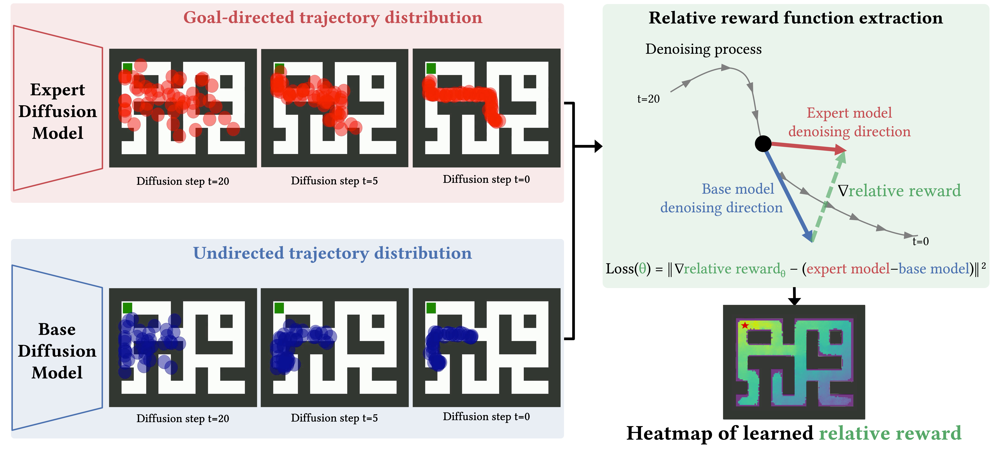

# Extracting Reward Functions from Diffusion Models

Official code for the NeurIPS 2023 paper [Extracting Reward Functions from Diffusion Models](https://openreview.net/forum?id=NN60HKTur2). If any problems arise with the code, feel free to reach out to nuti@robots.ox.ac.uk.



# Maze2D

## Installation

Download mujoco200 from https://www.roboti.us/download.html, extract it and copy it to `~/.mujoco/mujoco200`.
Download mujoco key file from https://www.roboti.us/file/mjkey.txt and add it to "~/.mujoco"

Add `~/.mujoco/mujoco200` to `LD_LIBRARY_PATH`:
```
echo "export LD_LIBRARY_PATH=$LD_LIBRARY_PATH:/users/<username>/.mujoco/mujoco200/bin" >> ~/.bashrc
echo "export CPATH=$CONDA_PREFIX/include:/users/<username>/.mujoco/mujoco200/include" >> ~/.bashrc
```

<!-- conda env create -f environment.yml -->
```
conda create --name maze_env_diffuser python=3.8
conda activate maze_env_diffuser

pip install setuptools==65.5.0
pip install torch==1.9.1+cu111 -f https://download.pytorch.org/whl/torch_stable.html
pip install -r requirements.txt
pip install -e .
```

Now install further required libraries:

```
source ~/.bashrc
conda activate maze_env_diffuser

conda install -c conda-forge glew 
conda install -c conda-forge mesalib 
conda install -c conda-forge glfw
conda install -c anaconda pyopengl

CPATH=$CPATH:~/anaconda3/envs/maze_env_diffuser/include pip install mujoco-py==2.0.2.5

pip install gym==0.18.0
```
<!-- pip install mujoco-py==2.0.2.13 -->

Finally, as we use `wandb` for the logging, make sure to login to Weights and Biases CLI and create a project named `diffusion_relative_rewards`.

## Download the data

To download the rollouts for training the diffusion models and relative reward functions, run:

```
chmod +x download_extract_dataset.sh
./download_extract_dataset.sh
```

The folder structure of the extracted file should look like:
```
d4rl_datasets/
├── maze2d-large-v1_10m_v1
├── maze2d-medium-v1_10m_v1
├── maze2d-open-v0_10m_v1
└── maze2d-umaze-v0_10m_v1
```

## Run main experiments from the paper

The script `run.py` takes care of running the correct command for each experiment. The commands themselves are in `maze2d/diffusion_training_commands` and `maze2d/experiment_commands`. For example, to run the experiments for the `maze2d-large-v1` maze with goal position 1, run the following, in this order:

```
# Run from the maze2d directory

# Preprocess the buffers if you haven't already
python run.py --dataset maze2d-large-v1  --goal goal1 --mode buffer --to_train base
python run.py --dataset maze2d-large-v1  --goal goal1 --mode buffer --to_train expert

# Train base model
python run.py --dataset maze2d-large-v1  --goal goal1 --mode diffusion --to_train base

# Train expert model
python run.py --dataset maze2d-large-v1  --goal goal1 --mode diffusion --to_train expert

# Once the expert and base models are trained, train the relative reward function
python run.py --dataset maze2d-large-v1  --goal goal1 --mode rrf
```

Observation: the base model is referenced as "general model" throughout the codebase.

The script `run.py` takes care of running the correct command for each experiment. The commands themselves are in `locomotion/experiment_commands/main_results.json`. For example, to run the experiments for the `halfcheetah`, run the following, in this order:

```
# Run from the maze2d directory

# Train base model
python run.py --dataset halfcheetah --action train_base

# Train expert model
python run.py --dataset halfcheetah --action train_expert

# Once the expert and base models are trained, train the relative reward function
python run.py --dataset halfcheetah --action train_rrf

# Run rollouts by steering the base model with the learned relative reward
python run.py --dataset halfcheetah --action rollouts
```

Observation: the base model is referenced as "general model" throughout the codebase.


# Mujoco Gym Locomotion

## Installation

Download mujoco200 from https://www.roboti.us/download.html, extract it and copy it to `~/.mujoco/mujoco200`.
Download mujoco key file from https://www.roboti.us/file/mjkey.txt and add it to "~/.mujoco"

Add `~/.mujoco/mujoco200` to `LD_LIBRARY_PATH`:
```
echo "export LD_LIBRARY_PATH=$LD_LIBRARY_PATH:/users/<username>/.mujoco/mujoco200/bin" >> ~/.bashrc
echo "export CPATH=$CONDA_PREFIX/include:/users/<username>/.mujoco/mujoco200/include" >> ~/.bashrc
```

<!-- conda env create -f environment.yml -->
```
conda create --name locomotion_env_diffuser python=3.8
conda activate locomotion_env_diffuser

pip install setuptools==65.5.0
pip install torch==1.9.1+cu111 -f https://download.pytorch.org/whl/torch_stable.html
pip install -r requirements.txt
pip install -e .
```

Now install further required libraries:

```
source ~/.bashrc
conda activate locomotion_env_diffuser

conda install -c conda-forge glew 
conda install -c conda-forge mesalib 
conda install -c conda-forge glfw
conda install -c anaconda pyopengl

CPATH=$CPATH:~/anaconda3/envs/locomotion_env_diffuser/include pip install mujoco-py==2.0.2.5

pip install gym==0.18.0
```

Finally, as we use `wandb` for the logging, make sure to login to Weights and Biases CLI and create a project named `diffusion_relative_rewards`.

## Run main experiments from the paper

The script `run.py` takes care of running the correct command for each experiment. The commands themselves are in `locomotion/experiment_commands/main_results.json`. For example, to run the experiments for the `halfcheetah`, run the following, in this order:

```
# Run from the locomotion directory

# Train base model
python run.py --dataset halfcheetah --action train_base

# Train expert model
python run.py --dataset halfcheetah --action train_expert

# Once the expert and base models are trained, train the relative reward function
python run.py --dataset halfcheetah --action train_rrf

# Run rollouts by steering the base model with the learned relative reward
python run.py --dataset halfcheetah --action rollouts
```

Observation: the base model is referenced as "general model" throughout the codebase.

# Stable Diffusion

## Environment setup

Create a new conda environment with python 3.8:
```
conda create --nama safe_env_diffuser python=3.8
conda activate safe_env_diffuser
```

Install the requirements:
```
pip install -r requirements.txt
```

Install our version of the `diffusers` library, modified to allow for extracting the intermediate latents of the diffusion process of the expert and base models:
```
cd diffusers
pip install -e .
```

## Obtaining the latents 

### Downloading the latents

To download the latents, run:

```
chmod +x download_extract_safe_data.sh
./download_extract_safe_data.sh
```

The folder structure of the extracted file should look like:
```
safe_stable_diffusion_data/                                                                                               
├── train                                                                                                                 
    ├── expert                                                                                                            
    │   ├── merged.pt  
    ├── general                                                                                                            
    │   ├── merged.pt  
```

### Generating the latents

Generate the latents using `utils/generate_latents.py`. The script supports having several processes dumping latents in parallel. 

You will need to login to Huggingface using `huggingface-cli login` in order to access Safe Stable Diffusion.

These are the exact commands we used:
```
python /users/nuti/code_remote/safe-stable-diffusion-irl/utils/generate_latents.py 0 expert --batch-size 100 --num-batches 12 --half-precision True
python /users/nuti/code_remote/safe-stable-diffusion-irl/utils/generate_latents.py 1 expert --batch-size 100 --num-batches 12 --half-precision True
python /users/nuti/code_remote/safe-stable-diffusion-irl/utils/generate_latents.py 2 expert --batch-size 100 --num-batches 12 --half-precision True
python /users/nuti/code_remote/safe-stable-diffusion-irl/utils/generate_latents.py 3 expert --batch-size 100 --num-batches 12 --half-precision True

python /users/nuti/code_remote/safe-stable-diffusion-irl/utils/generate_latents.py 0 general --batch-size 100 --num-batches 12 --half-precision True
python /users/nuti/code_remote/safe-stable-diffusion-irl/utils/generate_latents.py 1 general --batch-size 100 --num-batches 12 --half-precision True
python /users/nuti/code_remote/safe-stable-diffusion-irl/utils/generate_latents.py 2 general --batch-size 100 --num-batches 12 --half-precision True
python /users/nuti/code_remote/safe-stable-diffusion-irl/utils/generate_latents.py 3 general --batch-size 100 --num-batches 12 --half-precision True
```

Once these latents are dumped, merge them using the `utils/merge_latents.py` script:
```
python ./utils/merge_latents.py ./safe_stable_diffusion_data/train
```

## Reproducing the main plot in the paper

```
python ./scripts/train_gradient_matching.py --batch_size 64 --dim 32 --lr 0.0001 --train_frac 0.6 --seed 4 --gradient_clipping 0.002
```

# Cite
```
@inproceedings{
    nuti2023extracting,
    title={Extracting Reward Functions from Diffusion Models},
    author={Felipe Pinto Coelho Nuti and Tim Franzmeyer and Joao F. Henriques},
    booktitle={Thirty-seventh Conference on Neural Information Processing Systems},
    year={2023},
    url={https://openreview.net/forum?id=NN60HKTur2}
}
```

